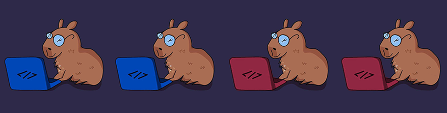
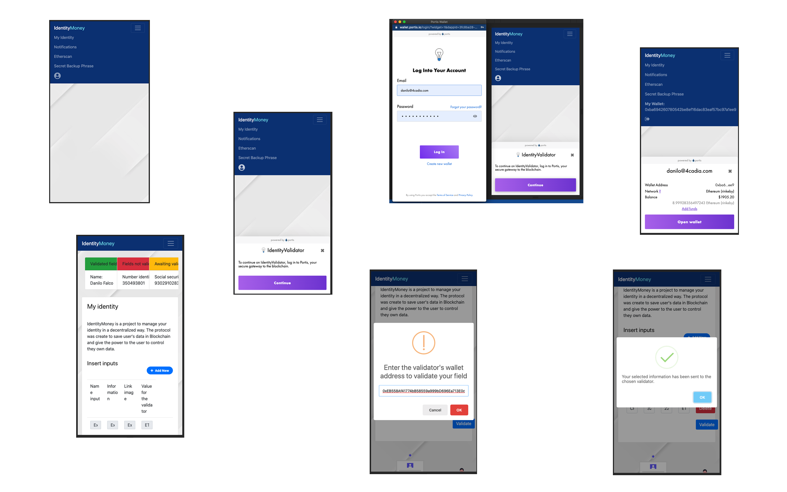

<p align="center">
  
</p>    

<p>
  <strong>IdentityMoney</strong> is a project to manage your identity in a decentralized way. The protocol was create to save user's data in Blockchain and give the power to the <i>user to control they own data</i>. This is an open source project, developed for presentation at HackMoney 2020, it can be used as a protocol for new application models.
  The basis of this module are smart contracts, created to save and manage the user's data and relationship between users, validators and consumers.
</p>



### User Story

As a Persona
- I can access the Portis dApp, create a new wallet or import an existing wallet
- I can identify myself as IdentityMoney Persona. So that I can use the dApp and manage my personal financial, personal and other information
- I can add more information to my identity
- I can send my information for validation by choosing who will validate and pay the reward for validating my information

### Behavior

This screen will not be displayed if the user has logged in before:
- **Screen: Login with Portis**
In this screen the user will execute the Portis call and log in with the Portis dApp
- **Screen: My identity**
In this screen the user can add, remove fields to submit validation for registered validators, also entering the amount that he wants to pay to the validator
- **Modal: Choice of validator**
This modal from the field choice, you click on validate and open a modal to insert the validator's wallet address
- **My identity Dashboard screen: Information from Validated fields (green), non-Validated fields (red) and fields awaiting Validation (Orange)**
This initial dashboard on the My identity screen shows you the status of your validations
- **Screen: Notifications**
In this screen you manage the notifications received by consumers who want to view your information
- **Etherscan Link Menu**
This link directs to transactions from the persona wallet to Etherscan
- **Screen: Secret Backup Phrase**
This allows you to view the mnemonic and private key of the persona wallet


- **Menu IdentityMoney**

 Option | Description |
 ------ |------|
My Identity |can add more personal information|
Notifications|recive notifications about consumers data|
Etherscan | link to transactions etherscan|
Secret Backup phrase| backup secret phrase|
Log in|log in portis.io |


## Pre Requirements

- It is necessary install [Node](https://nodejs.org/en/), [Npm](https://www.npmjs.com/) and [Ng](https://cli.angular.io/).

## How to Install

To install in developer mode, follow the step-by-step:
1. Download the repository on your computer. 
2. Access the directory where you downloaded this project and run the command below.
```sh
  $ npm install
  $ npm install -g @angular/cli
  $ npm install @portis/web3
```

## How to Run

Run the command below for generate build on your project.
```sh
 $ ng build
 $ ng serve
```

## Access Project

To access the project:
- It is necessary to install and configure the project on a server
- After installing you need domain and URL configuration
- Access the configured URL and good use

## Tech
To build this application was used:

 Technologies | Version |
 ------ |------|
  Angular  | 9.1.7 |
  Bootstrap | 3.3.7 |
